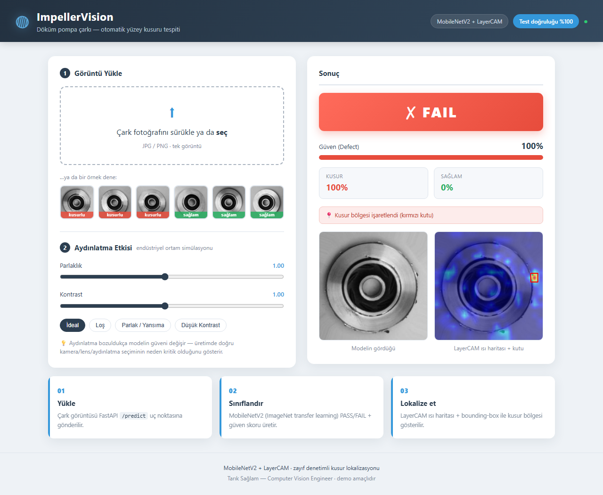
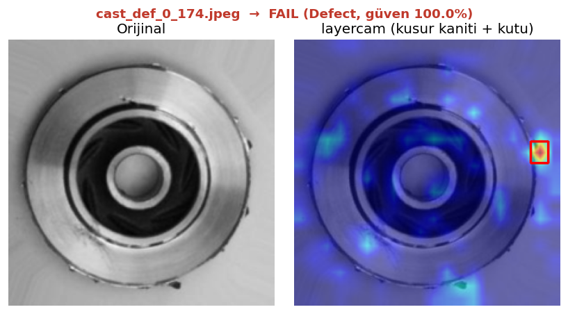
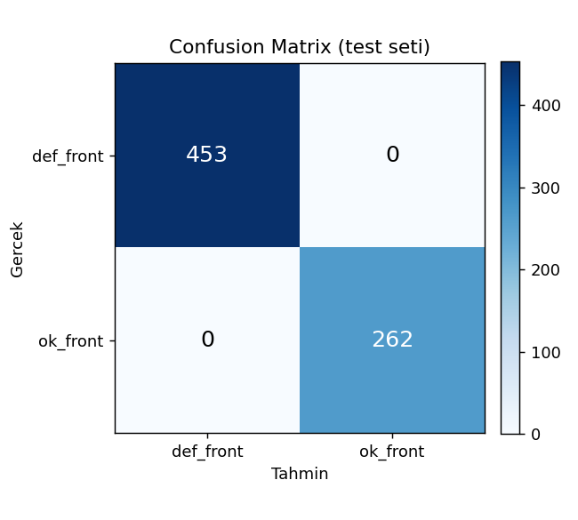
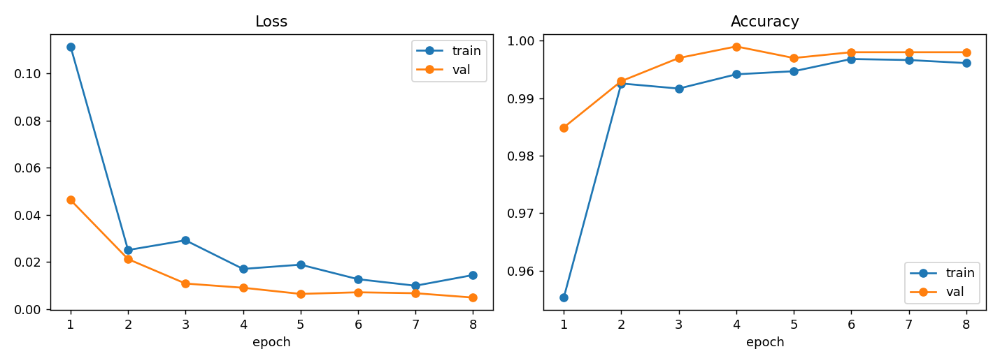

# ImpellerVision — Endüstriyel Kalite Kontrol (Machine Vision Demo)

Döküm pompa çarklarında (submersible pump impeller) otomatik **yüzey kusuru tespiti**.
Bir fotoğraf yüklenir → **PASS / FAIL** kararı + güven skoru + kusurun yerini gösteren
**LayerCAM ısı haritası**.

> Endüstriyel görüntü işleme (machine vision) demosu — donanım seçiminden modele,
> üretim hattı entegrasyonu perspektifiyle tasarlandı.



## Demo
- 🔗 Canlı: **https://aremak.lingoversa.com**
- ⚡ Otomatik demo: **https://aremak.lingoversa.com/#demo** (ilk örneği otomatik çalıştırır)
- 👤 Geliştirici portföyü: **https://aremak.lingoversa.com/portfolio/** (header'daki butondan da erişilir)
- 🎥 Video: _(eklenecek)_
- 💻 Yerel: `uvicorn app.main:app` → http://127.0.0.1:8000
- ⚡ Otomatik demo linki: `…/#demo` ilk örneği otomatik çalıştırır (tek tıkla göstermek için)

Arayüzde **örnek görüntü galerisi** var — ziyaretçi kendi çark fotoğrafı olmadan da
hemen deneyebilir. "Aydınlatma Etkisi" ayarıyla bozuk ışığın doğruluğa etkisi canlı görülür.

## Özellikler
- **Karar:** OK / Defect + güven yüzdesi (PASS/FAIL rozeti)
- **Lokalizasyon:** **LayerCAM** ile yüksek çözünürlüklü (20×20 ızgara, eski 7×7'ye karşı)
  kusur ısı haritası + FAIL durumunda kusur bölgesine **bounding-box**. Zayıf denetimli —
  kutu/maske etiketi olmadan, yalnız görüntü-seviyesi etiketle. Karar 224px'de (güvenilir),
  ısı haritası 320px'de (keskin) ayrı hesaplanır.
- **Aydınlatma duyarlılığı toggle'ı (gerçek zamanlı):** Slider'ı oynatınca görüntü
  tarayıcıda **anında** (CSS filtresi) değişir; karar + ısı haritası ise duraklayınca
  **debounce'lu** (~300 ms) sunucu çağrısıyla güncellenir (istek seli olmadan canlı his).
  Parlaklık/kontrast bozulunca tespit başarısının düşüşünü gösterir — endüstriyel
  aydınlatmanın neden kritik olduğunu anlatır (bkz. [donanım brief'i](docs/aremak_donanim_brief.md)).

Lokalizasyon detayı (sol: orijinal, sağ: ısı haritası + kusur kutusu):



## Sonuçlar

Test seti (715 görüntü) üzerinde değerlendirme:

| Metrik | Değer |
|---|---|
| **Accuracy** | **%100.0** |
| Precision (macro) | %100.0 |
| Recall (macro) | %100.0 |
| F1 (macro) | %100.0 |

**Confusion matrix:**

| | Tahmin: Defect | Tahmin: OK |
|---|---|---|
| **Gerçek: Defect** | 453 | 0 |
| **Gerçek: OK** | 0 | 262 |



> **Dürüstlük notu:** Bu Kaggle döküm veri seti, makine görüşü literatüründe bilinen, sınıfları
> net ayrışan "kolay" bir benchmark'tır; MobileNetV2 ile %99-100 doğruluk rutindir. Gerçek bir
> üretim hattında doğruluk; kamera/lens/aydınlatma kalitesine ve hat verisiyle yeniden eğitime
> bağlıdır (detay: donanım brief'i). Metrikler `src/train.py`'nin gerçek çıktısındandır.

Eğitim eğrileri: 

Ham metrikler: `outputs/metrics.json` · Lokalizasyon örnekleri: `outputs/localization_samples/`

## Veri Seti
Casting Product Image Data for Quality Inspection — Ravirajsinh Dabhi (Kaggle)
<https://www.kaggle.com/datasets/ravirajsinh45/real-life-industrial-dataset-of-casting-product>

| Split | def_front | ok_front |
|---|---|---|
| train | 3758 | 2875 |
| test | 453 | 262 |

Görüntüler 300×300 gri tonlama, klasör-bazlı (görüntü-seviyesi) etiketli. Kusurun *yeri*
etiketli değil → bu yüzden **classifier + Grad-CAM** (zayıf denetimli lokalizasyon) kullanıldı.

## Mimari
```
Görüntü ─► MobileNetV2 (ImageNet pretrained, fine-tune)
              ├─► Softmax ─► OK / Defect + güven skoru
              └─► LayerCAM (features[13], 320px) ─► ısı haritası + bbox
                              │
        Web UI (upload + aydınlatma toggle) ──► FastAPI /predict ──► JSON (karar+skor+base64 ısı)
```

**Tasarım kararları**
- **Model:** MobileNetV2 — hafif, edge donanımda (Jetson) gerçek zamanlı çalışır.
- **Lokalizasyon:** LayerCAM (yüksek çözünürlük + bbox) — kutu/maske etiketi olmadığı için
  YOLO/segmentasyon yerine. Daha da hassas sonuç için yol haritası: anomali tespiti
  (PatchCore/PaDiM, sadece OK görüntülerle) → etiket bütçesi varsa U-Net/YOLO.
- **Sınıf indeksleri:** `def_front=0` (Defect), `ok_front=1` (OK) — `ImageFolder` alfabetik.

## Teknolojiler
PyTorch · torchvision · pytorch-grad-cam · OpenCV · FastAPI · Docker

## Proje Yapısı
```
src/train.py       # Faz 1: eğitim → models/impeller_model.pt + outputs/
src/inference.py   # Ortak çıkarım modülü (model + tahmin + Grad-CAM)
src/localize.py    # Faz 2: örnek ısı haritaları + bbox → outputs/localization_samples/
app/main.py        # Faz 3: FastAPI backend (/predict, /health)
app/static/        # Faz 4: frontend (index.html, style.css, app.js) + samples/ (örnek görüntüler)
Dockerfile         # Faz 5: CPU-only inference imajı
docs/              # Faz 6: Aremak donanım brief'i + LinkedIn mesajı
```

## Kurulum & Çalıştırma
```bash
# 1) Bağımlılıklar
pip install -r requirements.txt

# 2) Eğitim (GPU otomatik algılanır; CPU için --cpu)
python src/train.py --epochs 8 --batch-size 64 --num-workers 0

# 3) Lokalizasyon örnekleri (LayerCAM + bbox)
python src/localize.py --n 6

# 4) Web demosu
uvicorn app.main:app --host 0.0.0.0 --port 8000
# → http://127.0.0.1:8000
```

> Windows notu: DataLoader için `--num-workers 0` önerilir (spawn kilitlenmesini önler).

## Ziyaret bildirimi (opsiyonel)
Demoya biri girince Gmail'e e-posta bildirimi gelir (sayfa açılışında `POST /track`).
- Kurulum: `cp .env.example .env` → Gmail **uygulama şifresi** ([buradan](https://myaccount.google.com/apppasswords)) ve hedef adresi gir.
- `.env` **git ve Docker imajından hariçtir** (gizli bilgi). Sunucuda ayrıca oluşturulur.
- **Her ziyaretçi için ömür boyu tek e-posta:** tarayıcıda kalıcı `localStorage` ID'si +
  sunucuda kalıcı dedupe dosyası (Docker volume). Aynı kişi tekrar girince mail gelmez.
- Arka planda gönderim (sayfayı yavaşlatmaz); SMTP ayarlı değilse `/track` no-op.
- Zaman damgası Türkiye saatiyle (UTC+3).

## Docker ile Deploy
```bash
docker compose up --build       # → http://localhost:8000
```
Canlı/SSL için servisi bir reverse proxy (Caddy / Nginx + certbot) arkasına alın
(repodaki `Caddyfile` hazır). **Oracle Cloud'da domain + SSL ile yayınlama** adım adım:
[`docs/deploy_oracle.md`](docs/deploy_oracle.md).

---
**Tarık Sağlam** — Computer Vision Engineer · [GitHub](https://github.com/tariksaglam645/Impeller-Vision) · [Canlı demo](https://aremak.lingoversa.com)
